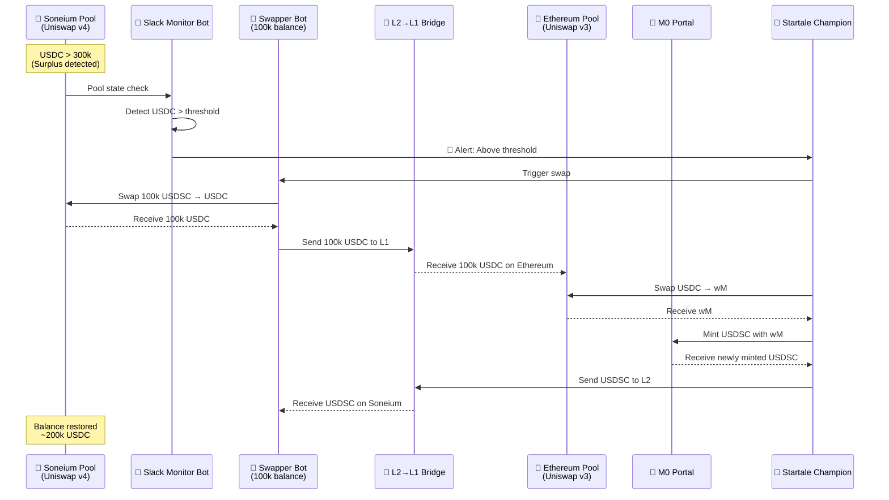
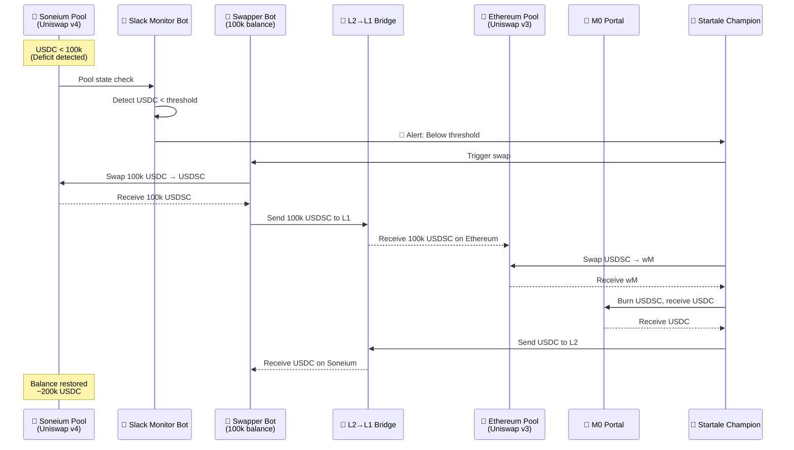

# Mint/Burn flows for USDSC
## Overview

The Uniswap v4 pool on Soneium holds Startale's initial investment. For simplicity, this document assumes:
- Pool liquidity: 1 million USD
- Total investment (including Swapper bot balance): 1.2 million USD
- Target USDC balance in pool: ~200k USD

The system maintains pool balance through automated alerts at ±100k thresholds.

| Condition | Action | Actor | Result |
|-----------|--------|-------|--------|
| USDC > 300k | Swap USDSC→USDC | Swapper Bot | Mint new USDSC |
| USDC < 100k | Swap USDC→USDSC | Swapper Bot | Burn USDSC |

## Actors:
1. 👤 Startale LP champion:
    * Provides Initial Liquidity to Uniswap v4 pool on Soneium
    * Swaps surplus amount of USDSC/USDC tokens
    * Bridge USDSC/USDC via liquidity bridge to Ethereum (or maybe this can be done with M0 portal)
    * Swaps USDSC/USDC for wM on Uniswap v3 pool on Ethereum [here](https://app.uniswap.org/explore/pools/ethereum/0x970A7749EcAA4394C8B2Bf5F2471F41FD6b79288)
    * Mints or burns USDSC on M0 portal and send USDSC or USDC back to Soneium

2. 🤖 Swapper liquidity bot
    * holds 100k USDSC/USDC
    * Performs automatic or manual swap in the pool
    * Sends Swapped USDSC/USDC token to the bridge

3. 🦄 Soneium Uniswap pool
    * v4 pool for USDSC/USDC swaps

4. 🌉 Bridge L2/L1
    * Moves tokens to/from L1/L2

5. 🦄 Ethereum Uniswap pool
    * v3 pool to swap USDC/wM

6. 🏦 M0 portal
    * Mint/Burn USDSC

7. 🔔 Slack-usdsc-monitor bot
    * Monitors pool USDC balance
    * Sends alerts when thresholds are breached

## Actions
* If there is a surplus of over 200+100=300k USDC in the pool
    * The slack-usdsc-monitor bot will fire an alert (Above threshold)
    * Swapper bot swaps 100k USDSC in the Soneium pool to get USDC
* If there is less than 100k of USDC in the pool 200-100=100k USDC in the pool
    * The slack-usdsc-monitor bot will fire an alert (Below threshold)
    * Swapper bot swaps 100k USDC in the Soneium pool to get USDSC
* Swapper/Champion bridges swapped tokens to Ethereum L1
* Champion swaps USDSC/USDC for wM on Uniswap v3 pool on Ethereum
* Champion uses M0-portal to mint/burn USDSC
* M0-portal sends USDSC/USDC back to Soneium's Swapper account

## Flow Diagrams
### USDSC Mint Scenario (Surplus USDC in Pool)

### USDSC Burn Scenario (Deficit USDC in Pool)

