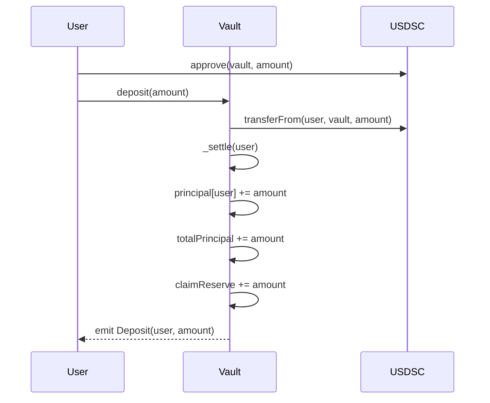
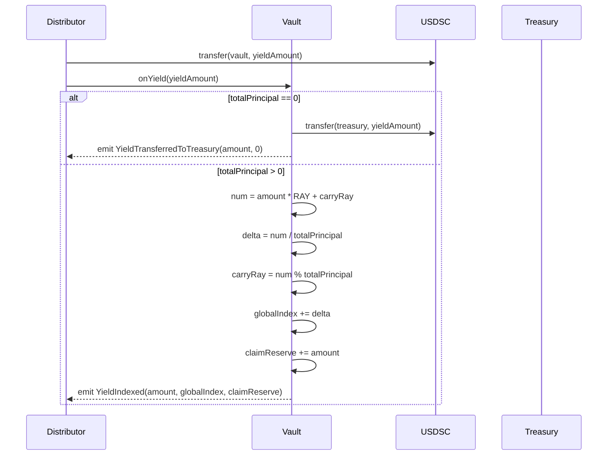
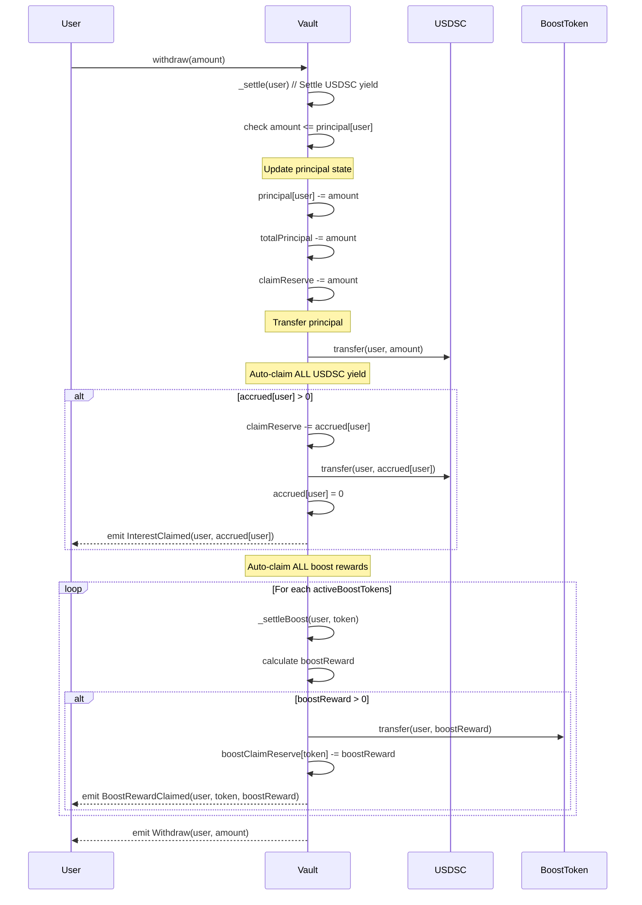
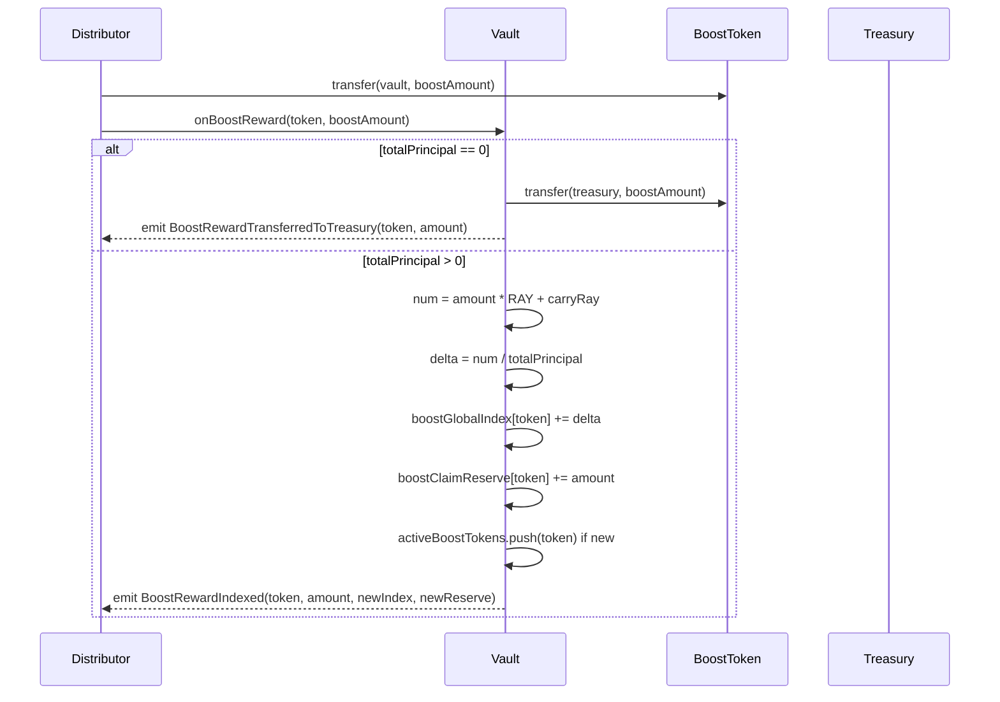
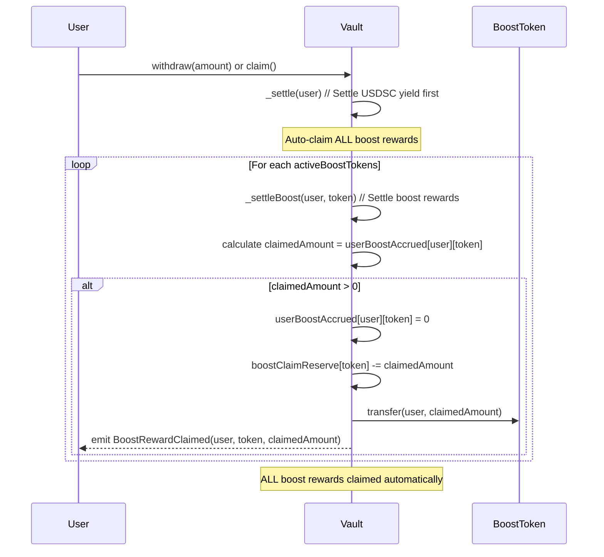
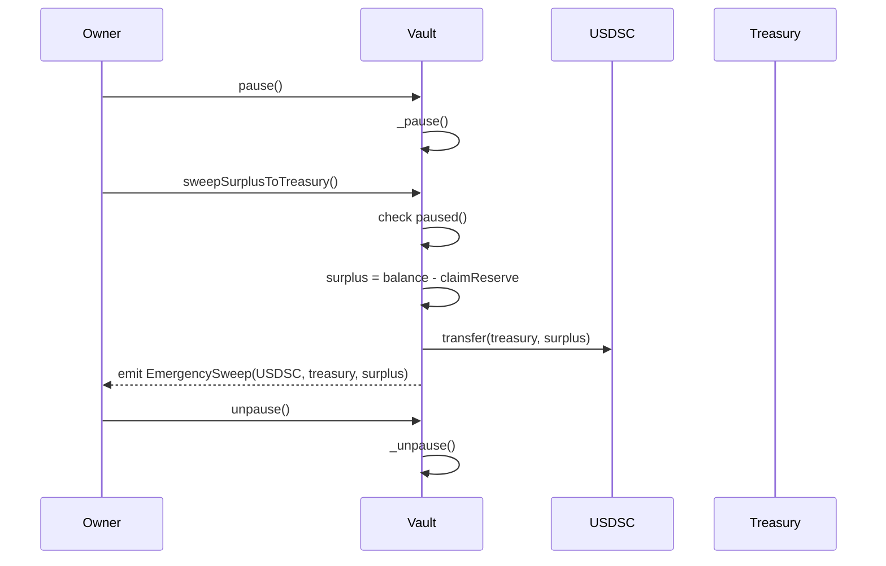

# EarnVault - Claimable Yield Vault with Boost Rewards

## Overview

Users deposit USDSC tokens and earn claimable yield over time, plus additional boost rewards in other ERC20 tokens (ASTR, DOT, etc.). Users maintain full control over their principal and can withdraw any amount up to their principal, with all accrued rewards (USDSC yield + boost rewards) automatically claimed on any withdrawal.

## Key Features

- **Principal Protection**: Withdraw original deposit anytime
- **Dual Reward System**: USDSC yield + boost rewards in other tokens
- **Automatic Reward Claiming**: Any withdrawal automatically claims ALL rewards (USDSC yield + boost rewards)
- **Withdrawal**: Withdraw any amount up to principal, get all rewards automatically
- **Proportional Distribution**: Both USDSC yield and boost rewards distributed based on deposit amounts
- **RAY Precision**: 1e27 precision for zero yield loss (MakerDAO standard)
- **Direct Treasury Transfer**: Yield goes directly to treasury when no deposits exist
- **Multi-Token Support**: Support for multiple boost reward tokens
- **Library Architecture**: Boost logic separated into reusable library
- **Role-Based Access Control**: Separate roles for different operations
- **Blacklist Support**: Simple compliance controls
- **Enhanced Security**: Overflow protection, reentrancy guards, pause mechanism

## Core Functions

### User Functions
```solidity
// Write functions
deposit(uint256 amount)                    // Deposit USDSC
depositWithPermit(...)                     // Deposit with permit (gasless approval)
withdraw(uint256 amount)                   // Withdraw any amount up to principal (auto-claims all rewards)
claim()                                    // Claim all accrued interest + all boost rewards

// Read functions
claimable(address user) → uint256          // View claimable USDSC interest amount
totalValue(address user) → uint256         // View total USDSC value (principal + claimable)
getUserInfo(address user) → (uint256 principal, uint256 claimable, uint256 total, uint256 lastIndex)
getClaimableBoostReward(address user, address token) → uint256  // View claimable boost rewards for specific token
getAllClaimables(address user) → (uint256 usdscClaimable, address[] boostTokens, uint256[] boostAmounts)  // Get all claimable rewards in one call
```

### Admin Functions
```solidity
// Yield distribution (yieldRedistributor only)
onYield(uint256 amount)                    // Distribute USDSC yield
onBoostReward(address token, uint256 amount)  // Distribute boost rewards (ASTR, DOT, etc.)

// Access control (owner only)
setYieldRedistributor(address who)         // Update yield redistributor
setTreasury(address who)                   // Update treasury address
setPauser(address who)                     // Update pauser address
setBlacklisted(address who, bool status)   // Manage blacklist

// Emergency controls (pauser only)
pause() / unpause()                        // Emergency stop/resume

// Treasury operations (owner only, when paused)
sweepSurplusToTreasury()                  // Sweep excess funds to treasury
recoverERC20(address token, address to, uint256 amount)  // Emergency token recovery

// Vault statistics
getVaultStats() → (uint256 totalPrincipal, uint256 claimReserve, uint256 globalIndex, uint256 pendingDelta, uint256 balance)
```

## Sequence Diagrams

### Basic User Flow


### Yield Distribution Flow


### User Withdrawal Flow


### Boost Reward Distribution Flow


### Boost Reward Claiming Flow


### Emergency Operations Flow


## How It Works

### Global Index Accounting
The vault uses a **global index pattern** for gas-efficient yield distribution:

1. **Global Index**: Tracks cumulative yield per unit deposited (RAY precision)
2. **User Index**: Records when user last settled
3. **Settlement Formula**: `owed = principal × (globalIndex - userIndex) / RAY`

### Ray-Space Carry Precision
Yield is distributed with perfect mathematical precision:
- **Problem**: Small yield amounts could cause rounding loss or fairness issues
- **Solution**: Ray-space carry mechanism ensures exact precision with no rounding loss
- **Implementation**: 
  ```solidity
  uint256 num = amount * RAY + carryRay;
  uint256 delta = num / totalPrincipal;        // Floor division
  carryRay = num % totalPrincipal;             // Remainder carried forward
  globalIndex += delta;                        // Apply immediately
  ```
- **Benefits**: Perfect precision, immediate fairness, no yield ever lost, gas efficient
- **Example**: 0.3 USDSC yield on 1000 USDSC principal = exact 0.3e9 delta with remainder carried

### Direct Treasury Transfer
When yield arrives with no deposits (`totalPrincipal = 0`):
- Yield is **transferred directly to treasury** immediately
- Treasury take all the yield of free floating USDSC

## Boost Rewards System

### Dual Reward Architecture
The vault supports two types of rewards:
1. **USDSC Yield**: Traditional yield in the same token as deposits
2. **Boost Rewards**: Additional rewards in other ERC20 tokens (ASTR, DOT, etc.)

### Boost Reward Distribution
Boost rewards use the **same proportional logic** as USDSC yield:
- **Distribution**: Based on user's USDSC principal amount
- **Precision**: RAY (1e27) precision for exact calculations
- **Fairness**: Users with more principal get proportionally more boost rewards

### Multi-Token Support
The vault tracks multiple boost reward tokens:
- **`activeBoostTokens[]`**: Array of all tokens that have been distributed
- **Per-token accounting**: Each token has its own global index and claim reserves
- **Automatic claiming**: All active boost tokens are claimed together

### Boost Reward States
```solidity
// Per-token global state
mapping(address => uint256) public boostGlobalIndex;     // token => global boost index
mapping(address => uint256) public boostClaimReserve;   // token => claimable boost reserves

// Per-user, per-token state  
mapping(address => mapping(address => uint256)) public userBoostIndex;    // user => token => last boost index
mapping(address => mapping(address => uint256)) public userBoostAccrued;  // user => token => accrued boost rewards

// Active tokens tracking
address[] public activeBoostTokens;  // List of tokens that have been distributed
```

### Boost Reward Lifecycle
1. **Distribution**: `onBoostReward(token, amount)` distributes boost rewards
2. **Accrual**: Users automatically accrue boost rewards based on their principal
3. **Claiming**: Users claim boost rewards via `withdraw()` or `claim()`
4. **Automatic**: All active boost tokens are claimed together

### Role-Based Security
- **Owner**: Full administrative control, emergency functions, 2-step ownership transfers
- **YieldRedistributor**: Can distribute yield and boost rewards to vault users
- **Pauser**: Can pause/unpause the contract for emergency response
- **Treasury**: Receives swept surplus funds

### Vault Statistics
The `getVaultStats()` function provides comprehensive vault information:
```solidity
function getVaultStats() external view returns (
    uint256 vaultTotalPrincipal,    // Total user deposits
    uint256 vaultClaimReserve,      // Total reserves for claims/withdrawals
    uint256 vaultGlobalIndex,       // Current global yield index
    uint256 vaultBalance,           // Actual USDSC balance in vault
    uint256 vaultCarryRay           // Ray-space carry remainder for precision
);
```

## Security Features

- **Funding Verification**: All yield functions verify actual token balance
- **Overflow Protection**: Safe arithmetic using `Math.mulDiv` for 512-bit precision
- **Complete Blacklist**: All user functions respect blacklist status
- **Reentrancy Protection**: All state-changing functions protected
- **Pause Mechanism**: Emergency stop for all operations (pauser-only)
- **Permit Safety**: Graceful handling of tokens that don't support permit
- **Settlement Ordering**: Critical `_settle()` called before state changes
- **ETH Safety**: Contract rejects ETH to prevent accidental loss
- **2-Step Ownership**: Secure ownership transfer using OpenZeppelin's Ownable2Step
- **Role Separation**: Clear separation between owner, yield redistributor, and pauser roles

## Withdrawal Examples

###  Withdrawal Logic
**Key Rule**: User can only withdraw up to their principal amount, but ANY withdrawal automatically claims ALL rewards (USDSC yield + boost rewards).

Given: User has 1000 USDSC principal + 100 USDSC accrued interest + 50 ASTR boost rewards

| Function Call | Amount | Result | Remaining |
|---------------|--------|--------|-----------|
| `withdraw(500)` | 500 USDSC | Gets 500 USDSC + 100 USDSC interest + 50 ASTR | 500 principal + 0 interest + 0 ASTR |
| `withdraw(1000)` | 1000 USDSC | Gets 1000 USDSC + 100 USDSC interest + 50 ASTR | 0 principal + 0 interest + 0 ASTR |
| `withdraw(1100)` | ❌ **REVERT** | Cannot withdraw more than principal | 1000 principal + 100 interest + 50 ASTR |
### Key Benefits
- **Simple**: Just withdraw any amount up to principal, get all rewards automatically
- **No Confusion**: No need to remember different functions or complex logic
- **Gas Efficient**: Single function call gets everything

### Important: Principal Withdrawal Impact
- **Withdrawing principal stops future interest accrual** on that amount
- **Remaining accrued interest can still be claimed** separately
- **This is standard DeFi behavior** - no principal = no new interest

## Examples

### Example 1: Basic User Flow with Boost Rewards
```solidity
// Alice deposits 1000 USDSC
vault.deposit(1000e6);
// Result: principal[alice] = 1000, userIndex[alice] = 1e27

// 100 USDSC yield is distributed
yieldRedistributor.transfer(address(vault), 100e6);
vault.onYield(100e6);
// Result: globalIndex increases proportionally

// 50 ASTR boost rewards are distributed
astr.transfer(address(vault), 50e18);
vault.onBoostReward(address(astr), 50e18);
// Result: boostGlobalIndex[astr] increases proportionally

// Alice checks and claims everything
uint256 usdscClaimable = vault.claimable(alice);  // Returns 100e6
uint256 astrClaimable = vault.getClaimableBoostReward(alice, address(astr));  // Returns 50e18
vault.claim();
// Result: Alice receives 100 USDSC + 50 ASTR, principal stays 1000
```

### Example 2: Multiple Users with Boost Rewards
```solidity
// Alice deposits 1000 USDSC (25%), Bob deposits 3000 USDSC (75%)
vault.deposit(1000e6);  // Alice
vault.deposit(3000e6);  // Bob

// 400 USDSC yield arrives
vault.onYield(400e6);

// 200 ASTR boost rewards arrive
astr.transfer(address(vault), 200e18);
vault.onBoostReward(address(astr), 200e18);

// Proportional distribution:
vault.claimable(alice);  // Returns 100e6 USDSC (25% of 400)
vault.claimable(bob);    // Returns 300e6 USDSC (75% of 400)

vault.getClaimableBoostReward(alice, address(astr));  // Returns 50e18 ASTR (25% of 200)
vault.getClaimableBoostReward(bob, address(astr));    // Returns 150e18 ASTR (75% of 200)
```

### Example 3: Withdrawal with Automatic Reward Claiming
```solidity
// Alice has 1000 principal + 50 USDSC claimable + 25 ASTR boost rewards
vault.principal(alice);   // 1000e6
vault.claimable(alice);   // 50e6 USDSC
vault.getClaimableBoostReward(alice, address(astr));  // 25e18 ASTR

// Option 1: Withdraw partial principal (ALL rewards claimed automatically)
vault.withdraw(500e6);  
// Result: Alice receives 500 USDSC + 50 USDSC + 25 ASTR, 500 principal remains

// Option 2: Withdraw all principal (ALL rewards claimed automatically)
vault.withdraw(1000e6);  
// Result: Alice receives 1000 USDSC + 50 USDSC + 25 ASTR, nothing remains

// Option 3: Claim rewards without withdrawing principal
vault.claim();
// Result: Alice receives 50 USDSC + 25 ASTR, 1000 principal remains
```

### Example 4: Multi-Token Boost Rewards
```solidity
// Alice deposits 1000 USDSC
vault.deposit(1000e6);

// Multiple boost rewards are distributed
astr.transfer(address(vault), 100e18);
vault.onBoostReward(address(astr), 100e18);

dot.transfer(address(vault), 50e10);
vault.onBoostReward(address(dot), 50e10);

// Alice claims all rewards at once
vault.claim();
// Result: Alice receives 100 ASTR + 50 DOT automatically

// Check individual token rewards
vault.getClaimableBoostReward(alice, address(astr));  // Returns 0 (claimed)
vault.getClaimableBoostReward(alice, address(dot));   // Returns 0 (claimed)
```

### Example 5: Direct Treasury Transfer
```solidity
// Yield arrives when no one has deposited
uint256 initialTreasuryBalance = usdsc.balanceOf(treasury);
vault.onYield(500e6);    // USDSC yield goes directly to treasury

// Boost rewards also go to treasury when no deposits
astr.transfer(address(vault), 100e18);
vault.onBoostReward(address(astr), 100e18);  // ASTR goes to treasury

// Treasury receives both yields immediately
usdsc.balanceOf(treasury); // Returns initialTreasuryBalance + 500e6
astr.balanceOf(treasury);  // Returns 100e18

// Later, Alice deposits
vault.deposit(1000e6);   
vault.claimable(alice);   // Returns 0 (no yield to claim yet)

// When new yield arrives, it gets processed normally
vault.onYield(200e6);    // Normal USDSC yield processing
vault.claimable(alice);   // Returns 200e6 (Alice gets new yield)

```

## Integration

### For Yield Distributors
```solidity
// 1. Transfer USDSC yield to vault
USDSC.transfer(vault, yieldAmount);
vault.onYield(yieldAmount);

// 2. Transfer boost rewards to vault
astr.transfer(vault, boostAmount);
vault.onBoostReward(address(astr), boostAmount);

// 3. Multiple boost tokens supported
dot.transfer(vault, dotAmount);
vault.onBoostReward(address(dot), dotAmount);
```

### For Frontend
```solidity
// Get all user info in one call (gas efficient)
(uint256 principal, uint256 claimable, uint256 total, uint256 lastIndex) = vault.getUserInfo(user);

// Or individual calls
uint256 claimable = vault.claimable(user);           // USDSC interest only
uint256 total = vault.totalValue(user);             // Principal + USDSC interest
uint256 deposited = vault.principal(user);          // Principal only
bool blocked = vault.isBlacklisted(user);           // Blacklist status

// Check boost rewards for specific tokens
uint256 astrRewards = vault.getClaimableBoostReward(user, address(astr));
uint256 dotRewards = vault.getClaimableBoostReward(user, address(dot));

// Get vault statistics (including pendingDelta)
(uint256 tvl, uint256 reserves, uint256 index, uint256 pending, uint256 balance) = vault.getVaultStats();
```

## Error Conditions

### User Errors
- `ZeroAmount()`: Zero amount operations
- `InsufficientPrincipal()`: Withdrawing more than deposited  
- `NothingToClaim()`: No yield available to claim
- `AddressBlacklisted()`: Blacklisted address attempting operation

### Access Control Errors
- `NotYieldRedistributor()`: Unauthorized yield distribution
- `NotAuthorizedToPause()`: Unauthorized pause/unpause attempt
- `CanNotBeZeroAddress()`: Zero address provided where invalid

### System Errors
- `InsufficientFunding()`: Vault cannot fulfill claims/withdrawals
- `ArithmeticOverflow()`: Integer overflow in calculations
- `ContractNotPaused()`: Operation requires paused state
- `ExceedsSurplus()`: Amount exceeds available surplus
- `EthNotAccepted()`: Contract doesn't accept ETH
- `PermitFailed()`: Permit operation failed (token may not support it)

## Events

### Key Events
- **`Deposit(address indexed user, uint256 amount)`**: User deposits USDSC
- **`Withdraw(address indexed user, uint256 amount)`**: User withdraws principal
- **`InterestClaimed(address indexed user, uint256 amount)`**: User claims accrued USDSC interest
- **`YieldIndexed(uint256 amount, uint256 newGlobalIndex, uint256 newClaimReserve)`**: USDSC yield distributed to users
- **`YieldTransferredToTreasury(uint256 amount)`**: USDSC yield transferred to treasury when no deposits exist

### Boost Reward Events
- **`BoostRewardIndexed(address indexed token, uint256 amount, uint256 newGlobalIndex, uint256 newClaimReserve)`**: Boost rewards distributed to users
- **`BoostRewardTransferredToTreasury(address indexed token, uint256 amount)`**: Boost rewards transferred to treasury when no deposits exist
- **`BoostRewardClaimed(address indexed user, address indexed token, uint256 amount)`**: User claims boost rewards

## Technical Notes

### Gas Efficiency
- **Yield Distribution**: ~200k gas regardless of user count
- **Boost Distribution**: ~300k gas for boost rewards (includes token transfers)
- **Ray-Space Carry**: Efficient unchecked arithmetic for perfect precision
- **getUserInfo**: Inlined calculations avoid external calls
- **Library Architecture**: Boost logic separated for gas optimization
- **Boost Token Indexing**: O(1) lookup for boost token tracking (eliminates linear search)
- **Mapping + Array Approach**: Efficient tracking of active boost tokens

### Precision & Safety
- **RAY Precision**: 1e27 prevents rounding errors
- **Ray-Space Carry**: Perfect precision with no rounding loss using carry mechanism
- **Unchecked Arithmetic**: Safe in carry calculations due to RAY precision
- **Funding Invariant**: `USDSC.balance >= claimReserve`
- **Boost Invariant**: `BoostToken.balance >= boostClaimReserve[token]`

### Error Handling
- **Specific Boost Errors**: `InsufficientBoostTokenBalance()` and `InsufficientBoostClaimReserve()` for precise error reporting
- **Blacklist Protection**: All user-facing functions protected against blacklisted addresses
- **Role-Based Access**: Comprehensive access control with proper role management
- **Input Validation**: Zero address and amount checks throughout

### Access Control Implementation
- **Ownable2Step**: Uses OpenZeppelin's secure 2-step ownership transfer
- **Custom Modifiers**: `onlyYieldRedistributor` and `onlyPauser` for specific role access
- **Direct Storage**: Simple address variables instead of complex role mappings
- **Clear Permissions**: Each role has distinct, non-overlapping responsibilities
- **Owner Functions**: `setYieldRedistributor()`, `setPauser()`, `setTreasury()`, `setBlacklisted()`
- **Pauser Functions**: `pause()`, `unpause()` (owner cannot directly pause)
- **Yield Redistributor Functions**: `onYield()`, `onBoostReward()`

### Library Architecture
The boost rewards system uses a separate library (`BoostRewardsLib`) for:
- **Separation of Concerns**: Boost logic isolated from main vault
- **Reusability**: Library can be used by other contracts

## Role Hierarchy

```
Owner (Full Control via Ownable2Step)
├── Set all role addresses (yieldRedistributor, pauser, treasury)
├── Emergency sweep operations
├── Blacklist management (setBlacklisted)
├── Treasury operations
├── 2-step ownership transfers
└── Renounce ownership

YieldRedistributor (Yield Operations)
├── Distribute yield via onYield()
├── Distribute boost rewards via onBoostReward()
└── Transfer to treasury

Pauser (Emergency Response)
├── Pause contract operations
└── Unpause contract operations

Treasury (Fund Recipient)
└── Receives swept surplus funds
```

### Role Management Features
- **Direct Storage Variables**: Simple address variables for yieldRedistributor and pauser
- **Custom Modifiers**: `onlyYieldRedistributor` and `onlyPauser` for access control
- **Ownable2Step**: Secure 2-step ownership transfer process
- **Clear Separation**: Each role has distinct, non-overlapping responsibilities
- **Owner Control**: Owner can change all role addresses but cannot directly pause

## Deployment Parameters

```solidity
constructor(
    address usdsc,                    // USDSC token contract
    address owner,                   // Initial owner (should be multisig)
    address yieldRedistributorAddr,  // Yield distribution contract
    address treasuryAddr,            // Treasury for surplus funds
    address pauserAddr               // Emergency pause authority
)
```

All addresses will be non-zero and carefully chosen for production deployment.

## Security: Index-Based Yield System

### Overview

The EarnVault uses a sophisticated **index-based yield system** to ensure fair, secure, and efficient yield distribution. This system prevents common vulnerabilities like double claiming and ensures users receive yield proportional to their principal and time held.

### How the Index System Works

#### Core Components

1. **`globalIndex`** - Tracks total yield distributed across all users (stored as RAY precision)
2. **`userIndex`** - Tracks the last point when a user's yield was settled (per user)
3. **`principal[user]`** - User's current principal amount
4. **`accrued[user]`** - User's accrued but unclaimed yield

#### The Mathematics

```solidity
// When yield is distributed:
globalIndex += (yieldAmount * RAY) / totalPrincipal

// When user interacts (deposit/withdraw/claim):
accruedYield = principal * (globalIndex - userIndex) / RAY
userIndex = globalIndex  // CRITICAL: Update user's index
```

### Security Guarantees

#### ✅ No Double Claiming Vulnerability

**The Problem:** Users could potentially withdraw small amounts repeatedly to claim the same yield multiple times.

**The Solution:** The index system prevents this by updating `userIndex` after each interaction:

```solidity
function _settle(address user) internal {
    uint256 p = principal[user];
    uint256 ui = userIndex[user];
    uint256 gi = globalIndex;
    
    if (p == 0) { 
        userIndex[user] = gi; 
        return; 
    }
    
    if (gi >= ui) {
        if (gi > ui) {
            uint256 owed = Math.mulDiv(p, gi - ui, RAY);
            accrued[user] += owed;
        }
        userIndex[user] = gi;  // ← CRITICAL: Always update index
    }
}
```

**Why This Works:**
- After each interaction, `userIndex` equals `globalIndex`
- Future yield calculations only consider NEW distributions
- Users cannot claim the same yield twice

#### ✅ Proportional Distribution

Yield is distributed proportionally based on:
- **Principal amount** - Users with more principal get more yield
- **Time held** - Yield accrues continuously while principal is deposited
- **Fair allocation** - No user can extract more than their fair share

### Real-World Example

#### Scenario: 6-Hour Yield Cycles

**Week 1: Initial Deposit**
```
Alice deposits: 1000 USDSC
Total vault principal: 1000 USDSC (Alice is the only user initially)
userIndex = 1e27 (initial global index)
globalIndex = 1e27
```

**28 Cycles of Yield Distribution**
```
Each cycle: 1 USDSC distributed
Total yield: 28 USDSC
globalIndex = 1e27 + (28e6 * 1e27) / 1000e6 = 1.028e27
Alice's accrued: 1000e6 * (1.028e27 - 1e27) / 1e27 = 28e6 USDSC
```

**Alice Withdraws 500 USDSC**
```
Alice gets: 500 USDSC principal + 28 USDSC yield = 528 USDSC
Remaining principal: 500 USDSC
Total vault principal: 1000 USDSC (Alice: 500 USDSC, Others: 500 USDSC)
userIndex updated to current globalIndex (1.028e27)
```

**Next Yield Cycle**
```
1 USDSC distributed across 1000 USDSC total principal
Alice gets: 500/1000 × 1 USDSC = 0.5 USDSC (50% of distribution)
```

**To Get 28 USDSC Again**
```
Need 56 more cycles (not 28)
Each cycle gives 0.5 USDSC (Alice's share is halved)
56 cycles × 0.5 USDSC = 28 USDSC
```

### Why This System is Secure

1. **Index-Based Tracking** - Prevents double claiming through mathematical precision
2. **Automatic Settlement** - User interactions trigger yield calculation and index updates
3. **Proportional Fairness** - Yield distributed based on principal and time
4. **No Gaming Possible** - Users cannot exploit the system through repeated small withdrawals
5. **Gas Efficient** - O(1) operations for yield calculations
6. **Precision Preserved** - RAY precision (1e27) ensures minimal rounding errors

### Technical Implementation

The index system is implemented in the `_settle()` function, which is called automatically on:
- `deposit()` - When users deposit
- `withdraw()` - When users withdraw
- `claim()` - When users claim yield

This ensures that yield is always calculated fairly and users cannot game the system.

## Advanced Security Analysis: Deposit-Back Attack Scenario

### The Attack Vector

A sophisticated attack vector involves:
1. User withdraws small amount (1 USDSC) to claim all accrued yield
2. User deposits the same amount back before next yield distribution
3. User claims full yield again from the new distribution

**Question:** Is this a vulnerability?

**Answer:** **NO** - This is perfectly fair behavior!

### Step-by-Step Analysis

#### Initial Setup
```
Alice deposits: 1000 USDSC
globalIndex = 1e27
userIndex[Alice] = 1e27
```

#### Phase 1: First Yield Distribution
```
100 USDSC yield distributed
globalIndex = 1.1e27
userIndex[Alice] = 1e27 (unchanged)
```

#### Phase 2: Alice Withdraws 1 USDSC
```solidity
// _settle() calculates:
accruedYield = 1000e6 * (1.1e27 - 1e27) / 1e27 = 100e6 USDSC
userIndex[Alice] = 1.1e27  // ← Updated to current global
```

**Alice gets:** 1 USDSC principal + 100 USDSC yield = 101 USDSC total
**Remaining principal:** 999 USDSC

#### Phase 3: Alice Deposits 1 USDSC Back
```
Alice deposits: 1 USDSC
New principal: 999 + 1 = 1000 USDSC
userIndex[Alice] = 1.1e27 (unchanged)
```

#### Phase 4: Second Yield Distribution
```
100 USDSC yield distributed
globalIndex = 1.1e27 + (100e6 * 1e27) / 1000e6 = 1.2e27
userIndex[Alice] = 1.1e27 (unchanged)
```

#### Phase 5: Alice Withdraws 1 USDSC Again
```solidity
// _settle() calculates:
accruedYield = 1000e6 * (1.2e27 - 1.1e27) / 1e27 = 100e6 USDSC
userIndex[Alice] = 1.2e27  // ← Updated again
```

**Alice gets:** 1 USDSC principal + 100 USDSC yield = 101 USDSC total again!

### Why This is NOT a Vulnerability

#### ✅ Mathematical Fairness

**First Yield Distribution:**
```
100 USDSC distributed across 1000 USDSC total principal
Alice gets: 1000/1000 × 100 USDSC = 100 USDSC ✅
```

**Second Yield Distribution:**
```
100 USDSC distributed across 1000 USDSC total principal
Alice gets: 1000/1000 × 100 USDSC = 100 USDSC ✅
```

**Total:** Alice received 200 USDSC from 200 USDSC distributed = **100% fair!**

#### ✅ No Double Claiming

- **First 100 USDSC:** From first yield distribution
- **Second 100 USDSC:** From second yield distribution
- **Each yield is from a DIFFERENT distribution cycle**
- **No double claiming possible**

#### ✅ Proportional Distribution

- Alice had 1000 USDSC principal during both distributions
- She's entitled to 100% of each distribution (she's the only user)
- The system correctly calculates her proportional share

### Real-World Analogy

Think of it like **dividend payments**:

1. **We (as user) own 1000 shares** of a company
2. **Company pays $100 dividend** → We get $100 (we own 100% of shares)
3. **We sell 1 share, then buy 1 share back** → We still own 1000 shares
4. **Company pays $100 dividend again** → We get $100 again (We still own 100% of shares)
5. **This is fair!** We owned 1000 shares during both dividend periods


### Key Security Principles

1. **Yield is calculated based on principal at distribution time** - not when user last interacted
2. **Proportional distribution ensures fairness** - users get exactly their fair share
3. **Index system prevents double claiming** - but allows legitimate yield accrual
4. **No gaming possible** - the system works as mathematically designed

### Conclusion

**The system correctly ensures that users receive yield proportional to their principal at the time of distribution, which is exactly how it should work.**
