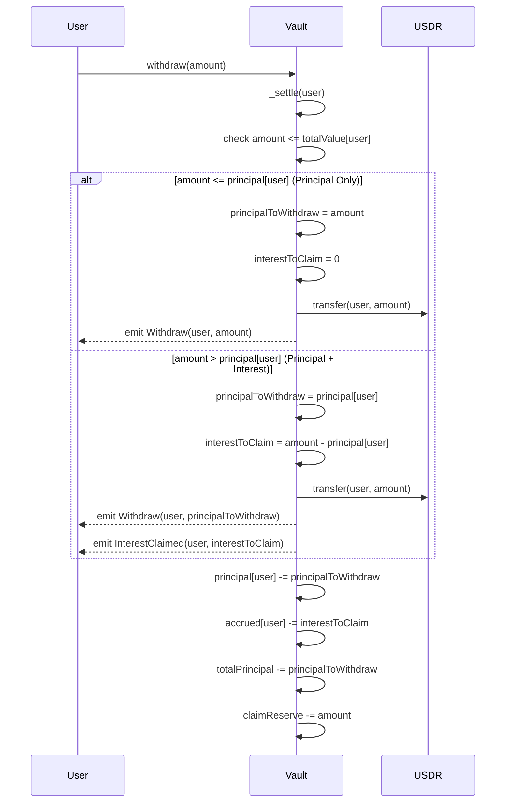
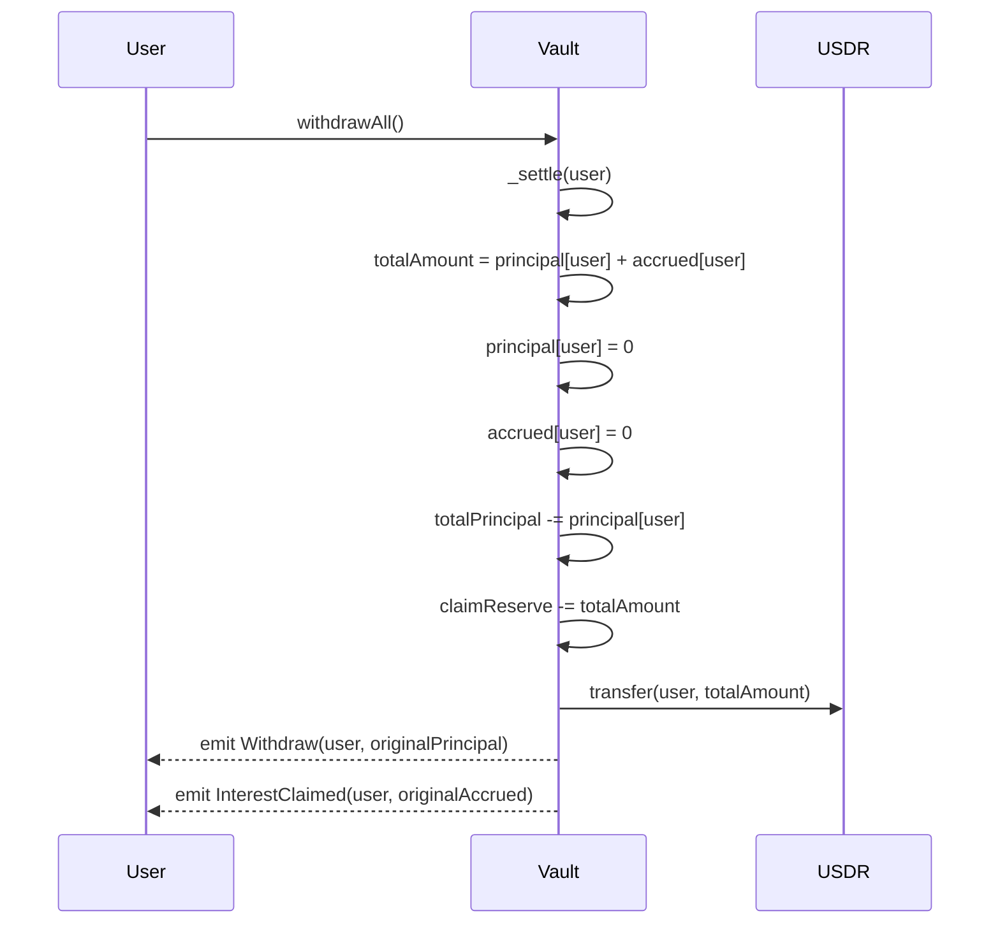
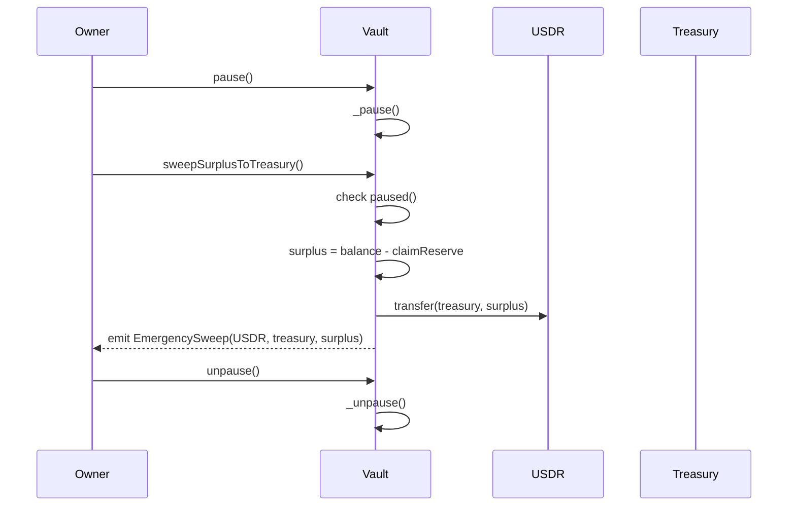

# EarnVault - Claimable Yield Vault

## Overview

Users deposit USDR tokens and earn claimable yield over time. Users maintain full control over their principal and can claim accrued interest separately or withdraw any amount including partial interest.

## Key Features

- **Principal Protection**: Withdraw original deposit anytime
- **Claimable Yield**: Interest accrues continuously, claim separately
- **Flexible Withdrawal**: Withdraw any amount (principal + partial interest)
- **Convenience Function**: `withdrawAll()` for complete withdrawal
- **Proportional Distribution**: Yield distributed based on deposit amounts
- **RAY Precision**: 1e27 precision for zero yield loss (MakerDAO standard)
- **Direct Treasury Transfer**: Yield goes directly to treasury when no deposits exist
- **Role-Based Access Control**: Separate roles for different operations
- **Blacklist Support**: Simple compliance controls
- **Enhanced Security**: Overflow protection, reentrancy guards, pause mechanism

## Core Functions

### User Functions
```solidity
// Write functions
deposit(uint256 amount)                    // Deposit USDR
depositWithPermit(...)                     // Deposit with permit (gasless approval)
withdraw(uint256 amount)                   // Withdraw any amount (principal + partial interest)
withdrawAll()                              // Withdraw everything (principal + all interest)
claim()                                    // Claim all accrued interest

// Read functions
claimable(address user) → uint256          // View claimable interest amount
totalValue(address user) → uint256         // View total value (principal + claimable)
getUserInfo(address user) → (uint256 principal, uint256 claimable, uint256 total, uint256 lastIndex)
```

### Admin Functions
```solidity
// Yield distribution (yieldRedistributor only)
onYield(uint256 amount)                    // Distribute yield

// Access control (owner only)
setYieldRedistributor(address who)         // Update yield redistributor
setTreasury(address who)                   // Update treasury address
setPauser(address who)                     // Update pauser address
setBlacklisted(address who, bool status)   // Manage blacklist

// Emergency controls (owner or pauser)
pause() / unpause()                        // Emergency stop/resume

// Treasury operations (owner only, when paused)
sweepSurplusToTreasury()                  // Sweep excess funds to treasury
emergencySweep(address token, address to, uint256 amount)  // Emergency token recovery

// Vault statistics
getVaultStats() → (uint256 totalPrincipal, uint256 claimReserve, uint256 globalIndex, uint256 pendingDelta, uint256 balance)
```

## Sequence Diagrams

### Basic User Flow


### Yield Distribution Flow


### User Withdrawal Flow


### WithdrawAll Flow


### Emergency Operations Flow


## How It Works

### Global Index Accounting
The vault uses a **global index pattern** for gas-efficient yield distribution:

1. **Global Index**: Tracks cumulative yield per unit deposited (RAY precision)
2. **User Index**: Records when user last settled
3. **Settlement Formula**: `owed = principal × (globalIndex - userIndex) / RAY`

### Ray-Space Carry Precision
Yield is distributed with perfect mathematical precision:
- **Problem**: Small yield amounts could cause rounding loss or fairness issues
- **Solution**: Ray-space carry mechanism ensures exact precision with no rounding loss
- **Implementation**: 
  ```solidity
  uint256 num = amount * RAY + carryRay;
  uint256 delta = num / totalPrincipal;        // Floor division
  carryRay = num % totalPrincipal;             // Remainder carried forward
  globalIndex += delta;                        // Apply immediately
  ```
- **Benefits**: Perfect precision, immediate fairness, no yield ever lost, gas efficient
- **Example**: 0.3 USDR yield on 1000 USDR principal = exact 0.3e9 delta with remainder carried

### Direct Treasury Transfer
When yield arrives with no deposits (`totalPrincipal = 0`):
- Yield is **transferred directly to treasury** immediately
- Treasury take all the yield of free floating USDR

### Role-Based Security
- **Owner**: Full administrative control, emergency functions
- **YieldRedistributor**: Can distribute yield to vault users
- **Pauser**: Can pause/unpause for emergency response
- **Treasury**: Receives swept surplus funds

### Vault Statistics
The `getVaultStats()` function provides comprehensive vault information:
```solidity
function getVaultStats() external view returns (
    uint256 vaultTotalPrincipal,    // Total user deposits
    uint256 vaultClaimReserve,      // Total reserves for claims/withdrawals
    uint256 vaultGlobalIndex,       // Current global yield index
    uint256 vaultBalance,           // Actual USDR balance in vault
    uint256 vaultCarryRay           // Ray-space carry remainder for precision
);
```

## Security Features

- **Funding Verification**: All yield functions verify actual token balance
- **Overflow Protection**: Safe arithmetic using `Math.mulDiv` for 512-bit precision
- **Complete Blacklist**: All user functions respect blacklist status
- **Reentrancy Protection**: All state-changing functions protected
- **Pause Mechanism**: Emergency stop for all operations
- **Permit Safety**: Graceful handling of tokens that don't support permit
- **Settlement Ordering**: Critical `_settle()` called before state changes
- **ETH Safety**: Contract rejects ETH to prevent accidental loss

## Withdrawal Examples

### Withdrawal Scenarios
Given: User has 1000 USDR principal + 100 USDR accrued interest

| Function Call | Amount | Result | Remaining |
|---------------|--------|--------|-----------|
| `withdraw(500)` | 500 USDR | Gets 500 USDR (principal only) | 500 principal + 100 interest |
| `withdraw(1000)` | 1000 USDR | Gets 1000 USDR (principal only) | 0 principal + 100 interest |
| `withdraw(1050)` | 1050 USDR | Gets 1050 USDR (1000 principal + 50 interest) | 0 principal + 50 interest |
| `withdraw(1100)` | 1100 USDR | Gets 1100 USDR (1000 principal + 100 interest) | 0 principal + 0 interest |
| `withdrawAll()` | - | Gets 1100 USDR (everything) | 0 principal + 0 interest |

### Key Features
- **Flexible**: `withdraw(amount)` can withdraw any amount up to total value
- **Precise**: Can withdraw principal + partial interest for exact amounts
- **Convenience**: `withdrawAll()` for simple "withdraw everything" use cases
- **Clear separation**: `withdraw()` for specific amounts, `withdrawAll()` for everything

### Important: Principal Withdrawal Impact
- **Withdrawing principal stops future interest accrual** on that amount
- **Remaining accrued interest can still be claimed** separately
- **This is standard DeFi behavior** - no principal = no new interest

## Examples

### Example 1: Basic User Flow
```solidity
// Alice deposits 1000 USDR
vault.deposit(1000e18);
// Result: principal[alice] = 1000, userIndex[alice] = 1e27

// 100 USDR yield is distributed
yieldRedistributor.transfer(address(vault), 100e18);
vault.onYield(100e18);
// Result: globalIndex increases proportionally

// Alice checks and claims her yield
uint256 claimable = vault.claimable(alice);  // Returns 100e18
vault.claim();
// Result: Alice receives 100 USDR, principal stays 1000
```

### Example 2: Multiple Users
```solidity
// Alice deposits 1000 USDR (25%), Bob deposits 3000 USDR (75%)
vault.deposit(1000e18);  // Alice
vault.deposit(3000e18);  // Bob

// 400 USDR yield arrives
vault.onYield(400e18);

// Proportional distribution:
vault.claimable(alice);  // Returns 100e18 (25% of 400)
vault.claimable(bob);    // Returns 300e18 (75% of 400)
```

### Example 3: Full Withdrawal Options
```solidity
// Alice has 1000 principal + 50 claimable
vault.principal(alice);   // 1000e18
vault.claimable(alice);   // 50e18

// Option 1: Withdraw exact principal (interest remains)
vault.withdraw(1000e18);  
// Result: Alice receives 1000 USDR, 50 USDR interest remains

// Option 2: Withdraw everything using withdrawAll()
vault.withdrawAll();      
// Result: Alice receives 1050 USDR (1000 + 50), nothing remains
```

### Example 4: Direct Treasury Transfer
```solidity
// Yield arrives when no one has deposited
uint256 initialTreasuryBalance = usdr.balanceOf(treasury);
vault.onYield(500e18);    // Yield goes directly to treasury

// Treasury receives the yield immediately
usdr.balanceOf(treasury); // Returns initialTreasuryBalance + 500e18

// Later, Alice deposits
vault.deposit(1000e18);   
vault.claimable(alice);   // Returns 0 (no yield to claim yet)

// When new yield arrives, it gets processed normally
vault.onYield(200e18);    // Normal yield processing
vault.claimable(alice);   // Returns 200e18 (Alice gets new yield)

// Simple and fair - no complex parking logic!
```

## Integration

### For Yield Distributors
```solidity
// 1. Transfer yield to vault
USDR.transfer(vault, yieldAmount);

// 2. Notify vault
vault.onYield(yieldAmount);
```

### For Frontend
```solidity
// Get all user info in one call (gas efficient)
(uint256 principal, uint256 claimable, uint256 total, uint256 lastIndex) = vault.getUserInfo(user);

// Or individual calls
uint256 claimable = vault.claimable(user);           // Interest only
uint256 total = vault.totalValue(user);             // Principal + interest
uint256 deposited = vault.principal(user);          // Principal only
bool blocked = vault.isBlacklisted(user);           // Blacklist status

// Get vault statistics (including pendingDelta)
(uint256 tvl, uint256 reserves, uint256 index, uint256 pending, uint256 balance) = vault.getVaultStats();
```

## Error Conditions

### User Errors
- `ZeroAmount()`: Zero amount operations
- `InsufficientPrincipal()`: Withdrawing more than deposited  
- `NothingToClaim()`: No yield available to claim
- `AddressBlacklisted()`: Blacklisted address attempting operation

### Access Control Errors
- `NotYieldRedistributor()`: Unauthorized yield distribution
- `NotAuthorizedToPause()`: Unauthorized pause/unpause attempt
- `CanNotBeZeroAddress()`: Zero address provided where invalid

### System Errors
- `InsufficientFunding()`: Vault cannot fulfill claims/withdrawals
- `ArithmeticOverflow()`: Integer overflow in calculations
- `ContractNotPaused()`: Operation requires paused state
- `ExceedsSurplus()`: Amount exceeds available surplus
- `EthNotAccepted()`: Contract doesn't accept ETH
- `PermitFailed()`: Permit operation failed (token may not support it)

## Events

### Key Events
- **`Deposit(address indexed user, uint256 amount)`**: User deposits USDR
- **`Withdraw(address indexed user, uint256 amount)`**: User withdraws principal
- **`InterestClaimed(address indexed user, uint256 amount)`**: User claims accrued interest
- **`YieldIndexed(uint256 amount, uint256 newGlobalIndex, uint256 newClaimReserve)`**: Yield distributed to users
- **`YieldTransferredToTreasury(uint256 amount)`**: Yield transferred to treasury when no deposits exist

## Technical Notes

### Gas Efficiency
- **Yield Distribution**: ~200k gas regardless of user count
- **Ray-Space Carry**: Efficient unchecked arithmetic for perfect precision
- **getUserInfo**: Inlined calculations avoid external calls

### Precision & Safety
- **RAY Precision**: 1e27 prevents rounding errors
- **Ray-Space Carry**: Perfect precision with no rounding loss using carry mechanism
- **Unchecked Arithmetic**: Safe in carry calculations due to RAY precision
- **Funding Invariant**: `USDR.balance >= claimReserve`

## Role Hierarchy

```
Owner (Full Control)
├── Set all role addresses
├── Emergency sweep operations
├── Blacklist management
└── Treasury operations

YieldRedistributor (Yield Operations)
├── Distribute yield via onYield()
└── Transfer to treasury

Pauser (Emergency Response)
├── Pause contract operations
└── Unpause contract operations

Treasury (Fund Recipient)
└── Receives swept surplus funds
```

## Deployment Parameters

```solidity
constructor(
    address usdr,                    // USDR token contract
    address owner,                   // Initial owner (should be multisig)
    address yieldRedistributorAddr,  // Yield distribution contract
    address treasuryAddr,            // Treasury for surplus funds
    address pauserAddr               // Emergency pause authority
)
```

All addresses will be non-zero and carefully chosen for production deployment.